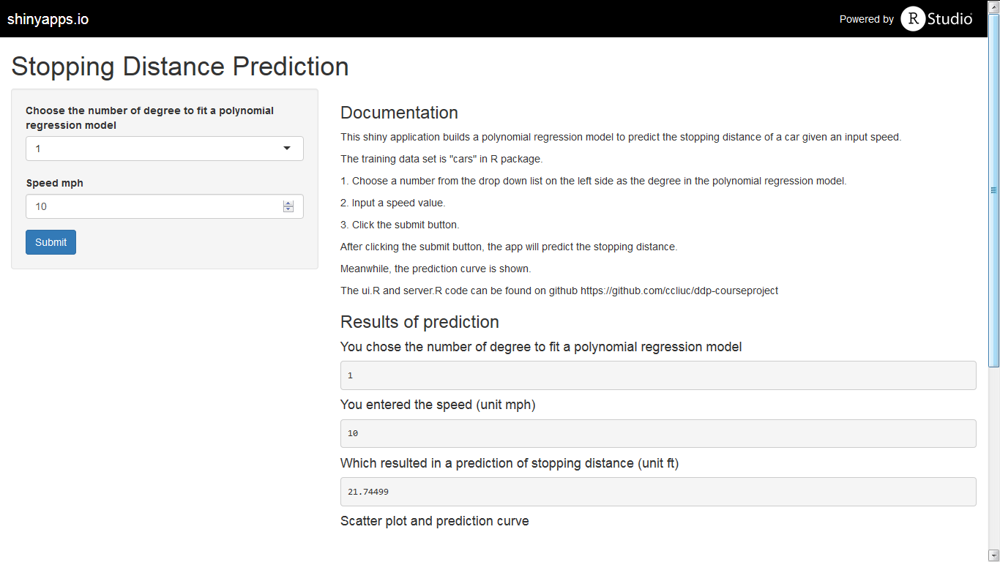
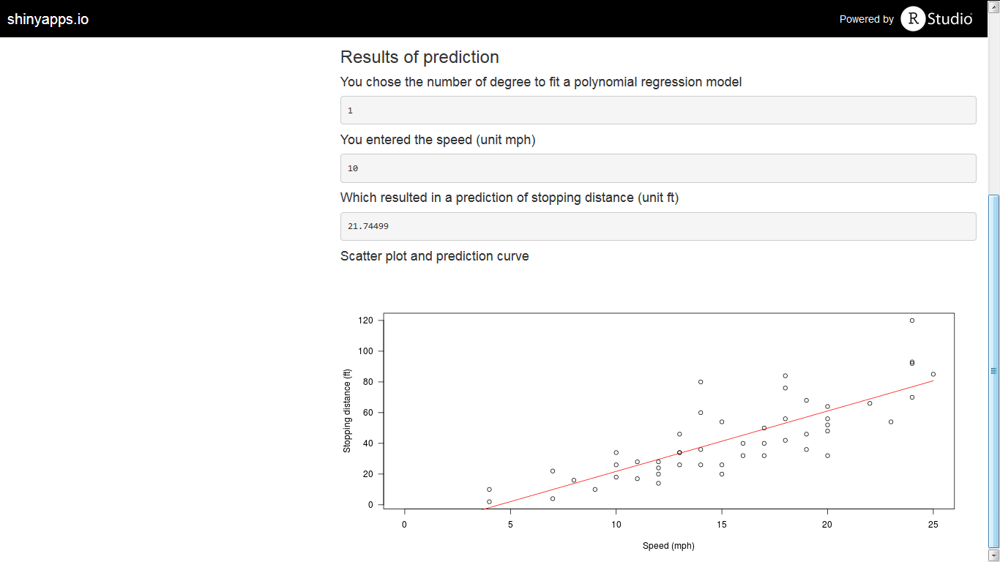

## Instructions
This shiny application builds a polynomial regression model to predict the stopping distance of a car given an input speed.To use the shiny app (https://ccliuc.shinyapps.io/CourseProject/), please follow the steps below.

1. Choose a number from the drop down list on the left side as the degree in the polynominal regression model.

2. Input a speed value.

3. Click the submit button.

After clicking the submit button, the app will predict the stopping distance.

Meanwhile, the prediction curve is shown.

---

## Input interface

---

## Output interface

